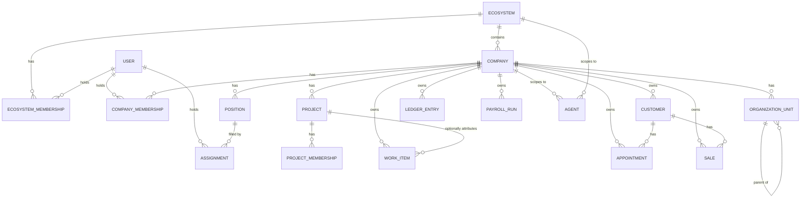

# Domain Model (Phần 2)

## Cập nhật Phần 6 — Finance/Payroll/Commission/Inventory đã implement thật

Mục "Generic Business Domains" bên dưới liệt kê `LedgerEntry`/`PayrollRun`
conceptual từ Phần 2 — đã implement với delta cụ thể so với draft: `Payment`
và `Expense` tách riêng thay vì 1 `Transaction` gộp (ADR-025); Receivable
KHÔNG có bảng riêng, tính derived (ADR-026); `LedgerEntry` sửa bằng
correction record (`correctionOfEntryId` self-FK), không update/delete
(ADR-027); thêm `ApprovalRequest` — 1 primitive dùng chung cho 2-người-duyệt
(Payroll Finalize + Inventory Adjustment, ADR-028/029), không có trong draft
Phần 2; `CommissionCalculation` với `allocationBps` tường minh (ADR-030) mà
draft không đặc tả chi tiết; `StockMovement` là nguồn sự thật duy nhất cho
tồn kho, không có cột số dư mutable nào (ADR-031). Chi tiết:
`docs/domain/FINANCE.md`, `PAYROLL.md`, `COMMISSION.md`, `INVENTORY.md`.

## Cập nhật Phần 5 — CRM/Lead/Appointment/Sales đã implement thật

Mục "Generic Business Domains" bên dưới liệt kê `Customer`/`Appointment`/
`Sale` conceptual từ Phần 2 — đã implement đúng ownership (Company-owned,
attribution qua OrgUnit/Project optional) nhưng KHÔNG đúng 100% field-level
như draft: thêm `Lead` (không có trong draft Phần 2, quyết định dựa bằng
chứng legacy thật — ADR-017), thêm `CatalogItem`/`SaleLine` (Sale ở Phần 2
chưa tách catalog/line-item), `Customer.phone` mã hoá tại rest thay vì
plaintext (ADR-023). KHÔNG có `SalesOpportunity` dù draft gợi ý (không đủ
bằng chứng — ADR-019). Chi tiết: `docs/domain/CRM.md` và các file domain
con.

## Cập nhật Phần 4 — Organization/Project/Work Core đã implement thật

Ba mục "Organization", "Project", "Work Core" bên dưới là conceptual draft
Phần 2 — đã implement đúng như mô tả ở Phần 4, với các delta cụ thể: field
`orgUnitId` trong draft này trở thành `organizationUnitId` trong schema thật
(rõ nghĩa hơn); `Position` không có `orgUnitId?` (đúng như draft đã dự
đoán — "nếu ... chưa có ai thật sự cần kiêm nhiệm/lịch sử vị trí, được phép
defer Assignment" đã KHÔNG xảy ra — Assignment implement ngay vì nhu cầu
kiêm nhiệm/chuyển chi nhánh có ví dụ thật từ Bệnh viện Hồng Phúc); `Project`
có thêm `owningUnitId?`/`budgetAmount?` (không có trong draft, thêm vì mục
CVII Master Prompt yêu cầu Project gắn được với 1 đơn vị chủ quản). Chi tiết
implementation, lý do quyết định, invariant giữ nguyên: `docs/domain/
ORGANIZATION.md`, `docs/domain/WORK_CORE.md`, `docs/domain/PROJECT.md`.

Conceptual schema draft — KHÔNG phải Prisma schema thật (Phần 2 không implement
full database, xem `docs/project/CURRENT_WAVE.md`). Mục đích: chứng minh
ownership, cardinality, scope, lifecycle. Field list là tối thiểu cần thiết,
không phải đặc tả đầy đủ.

## Sơ đồ tổng quan



Company là mắt xích trung tâm của mọi dữ liệu business. Ecosystem chỉ chứa
Company + Membership + Agent scope — không chứa business data trực tiếp.

## Platform (không phải domain nghiệp vụ)

Không có model business ở tầng này. Chỉ capability nền: Authentication,
Security, Database, Background execution, Observability, Audit primitives,
File storage abstraction, AI execution infrastructure. Xem
`docs/architecture/SECURITY_BOUNDARIES.md`.

*(Sửa sau red-team review: đã bỏ "Feature configuration primitives" khỏi
danh sách — không có định nghĩa/use case cụ thể nào trong toàn bộ tài liệu
Phần 2, đúng dạng "config engine gọi tên trước khi có nhu cầu" mà chính dự
án này đang cố tránh — mục CXXIX. Nếu về sau cần feature flag cấp
boot-time đơn giản kiểu `ENABLE_ZENITH_V2` cũ, thêm lại khi có driver cụ
thể, không giữ tên trống.)*

## Identity

```
User
  id
  name
  loginIdentifier (email/phone — theo Auth Phần 3 quyết định)
  credentialLinkage
  status              // ACTIVE | DISABLED
  profile
  createdAt / updatedAt
```

`User` KHÔNG mang role business global. `User ≠ Role` — role/permission luôn
scoped qua Membership (xem Law bên dưới).

## Ecosystem

```
Ecosystem
  id
  code
  name
  status              // ACTIVE | SUSPENDED | ARCHIVED
  defaultCurrency
  defaultTimezone
  createdAt / updatedAt

EcosystemMembership
  id
  ecosystemId
  userId
  role                // FOUNDER | ECOSYSTEM_ADMIN | AUDITOR | VIEWER | CUSTOM
  permissions?         // override JSON nếu CUSTOM
  status              // ACTIVE | REVOKED
  createdAt / updatedAt
  @@unique(ecosystemId, userId)
```

GLOBAL không bao giờ có nghĩa "toàn database" — luôn là "trong phạm vi một
Ecosystem". Một deployment ban đầu seed đúng 1 Ecosystem (config/seed, không
hard-code ID trong source).

**Ranh giới quyền theo từng role EcosystemMembership (chốt sau red-team
review — tránh lặp lại đúng hình dạng lỗ hổng `user.role === "ADMIN"` đã
xảy ra thật ở ZenithTasks với cái tên khác):**

- `FOUNDER` — xem aggregate mọi Company trong Ecosystem theo quyền. **Ghi/
  sửa dữ liệu vào một Company cụ thể vẫn bắt buộc có `CompanyMembership`
  tường minh (hoặc grant tường minh tương đương) trên đúng Company đó** —
  làm Founder KHÔNG tự động mở khoá ghi vào mọi Company chỉ bằng
  `EcosystemMembership.role = FOUNDER`.
- `ECOSYSTEM_ADMIN` — **cùng ràng buộc như FOUNDER về ghi Company** (không
  tự động ghi được Company nào nếu không có CompanyMembership ở đó); khác
  Founder ở phạm vi cấu hình Ecosystem-level (invite thành viên Ecosystem,
  quản lý danh sách Company) chứ không phải ở việc bypass Company boundary.
  Đây là role dễ bị hiểu nhầm nhất do tên gần giống "ADMIN" — Phần 3 bắt
  buộc có acceptance test negative riêng cho role này, y hệt kiểu test đã
  có cho AI tool argument injection.
- `AUDITOR` — chỉ đọc, không ghi bất kỳ đâu.
- `VIEWER` — chỉ đọc aggregate theo quyền, hẹp hơn Auditor (không xem chi
  tiết nhạy cảm).
- `CUSTOM` — permission override tường minh, không mặc định rộng hơn VIEWER.

## Company — first-class tenant

```
Company
  id
  ecosystemId
  code
  name
  legalName?
  type                // GENERAL | HEALTHCARE | OTHER   (xem ghi chú dưới)
  status              // DRAFT | ACTIVE | SUSPENDED | ARCHIVED
  currency
  timezone
  createdAt / updatedAt
  @@unique(ecosystemId, code)   // ADR-012: unique trong Ecosystem, không global

CompanyMembership
  id
  companyId
  userId
  rolePreset          // OWNER | COMPANY_ADMIN | MANAGER | EMPLOYEE | VIEWER | AUDITOR | CUSTOM
  permissions?         // override JSON nếu CUSTOM
  status              // ACTIVE | REVOKED
  createdAt / updatedAt
  @@unique(companyId, userId)
```

`Company.type` chỉ phục vụ onboarding/preset/default dashboard — KHÔNG rẽ
nhánh schema (không `if type == HEALTHCARE then <toàn bộ bảng khác>`). Giá
trị Phần 2 chỉ chốt `GENERAL | HEALTHCARE | OTHER` — đúng số Company thật sự
biết trước (Bệnh viện Đa khoa Hồng Phúc = HEALTHCARE). `AESTHETICS`/
`DISTRIBUTION`/`SERVICE`/`RETAIL` **cố tình chưa thêm** (sửa sau simplicity
review — thêm enum value là migration rẻ/an toàn, nên chỉ thêm khi có Company
thật thuộc loại đó, không pre-bake trước theo mục CXXIX).

**OWNER ≠ COMPANY_ADMIN** (Law XVII, Phần 2 mục XVII): Owner là quyền sở hữu
business cao nhất; Company Admin là người vận hành cấu hình được Owner/Founder
giao — không tự động là chủ doanh nghiệp.

### Company lifecycle

`DRAFT → ACTIVE → SUSPENDED → ARCHIVED`. `DRAFT` **chốt dứt điểm là có**
(sửa sau simplicity review — tài liệu trước đó để `DRAFT?` mập mờ): dùng
cho khoảng thời gian onboarding wizard chưa hoàn tất (Phần 9 có onboarding
hỏi 5-7 câu rồi tự cấu hình — Company chưa "hiện diện" đầy đủ tới khi ra
khỏi DRAFT). SUSPEND ≠ xoá dữ liệu (chặn ghi nghiệp vụ mới + dừng AI actions + dừng
automation nền + vẫn giữ audit + Founder/Admin vẫn xem theo quyền). ARCHIVE ≠
DELETE. Hard delete chỉ áp dụng Company test trống, chưa có business data.
Chi tiết implement thuộc Phần 3, ở đây chỉ chốt invariant.

## Organization — nơi con người thuộc về

```
OrganizationUnit
  id
  companyId
  parentId?            // self-relation, tạo cây
  type                 // BRANCH | DEPARTMENT | TEAM | FUNCTION | BUSINESS_UNIT
  code
  name
  createdAt / updatedAt

Position
  id
  companyId
  orgUnitId?
  name                 // "Giám đốc", "Bác sĩ Tim mạch", "Kế toán"...
  permissionPackRef?    // liên kết capability group, KHÔNG phải login role
  createdAt / updatedAt

Assignment
  id
  userId
  companyId
  positionId
  orgUnitId?
  startAt?
  endAt?
  status               // ACTIVE | ENDED
  createdAt / updatedAt
```

Branch KHÔNG mặc định là Company (Law XXVII). Position ≠ Permission (Law XX):
"Bác sĩ Tim mạch" là organizational identity, không phải authorization —
authorization đến từ `permissionPackRef`/`CompanyMembership.permissions`.

**Vì sao `Assignment` là entity riêng, không gộp vào `Position`/
`CompanyMembership`** (bổ sung sau simplicity review — legacy
`ZProjectAssignment` từng là dead code, cần lý do cụ thể hơn "domain law
trừu tượng"): nhu cầu thật đã biết trước ở Company đầu tiên (Bệnh viện Đa
khoa Hồng Phúc) là **kiêm nhiệm và chuyển đổi vị trí có lịch sử theo thời
gian** — một bác sĩ có thể vừa giữ Position "Bác sĩ điều trị" vừa "Trưởng
khoa" cùng lúc (nhiều Position đồng thời), hoặc chuyển từ chi nhánh Hải
Phòng sang Hà Nội với ngày bắt đầu/kết thúc rõ (mục XXIX Master Prompt:
"chuyển phòng; kiêm nhiệm; nhiều vai trò; lịch sử tổ chức"). `Position` tự
nó là định nghĩa tĩnh (một chức danh có thể có nhiều người giữ qua nhiều
giai đoạn); `CompanyMembership` là quan hệ User↔Company cho authorization,
không mang ngữ nghĩa thời gian/tổ chức. `Assignment` là bảng duy nhất giữ
được cả 2: nhiều dòng đồng thời (kiêm nhiệm) + `startAt`/`endAt` (lịch sử).
Nếu tới lúc bắt đầu Phần 3 vẫn chưa có ai thật sự cần kiêm nhiệm/lịch sử vị
trí, được phép defer `Assignment` và chỉ dùng `Position.orgUnitId` +
`CompanyMembership` trước — nhưng đây là bằng chứng near-term cụ thể, không
phải "vì domain law nói vậy".

## Project — nơi công việc có vòng đời diễn ra

```
Project
  id
  companyId            // BẮT BUỘC, không nullable (Law/mục LXXV — nullable
                        // để "linh hoạt" chính là kiểu ambiguity làm ZenithTasks lệch)
  code?
  name
  description?
  ownerUserId?
  status               // PLANNED | ACTIVE | ON_HOLD | COMPLETED | CANCELLED | ARCHIVED
  startDate? / dueDate? / budget?
  createdAt / updatedAt

ProjectMembership
  id
  projectId
  userId
  role?
  status
  createdAt / updatedAt
```

Project KHÔNG sở hữu mini-ERP riêng (Law XXXI): không có Customer/Payroll/
Ledger/Sales riêng. Nó **tham chiếu** dữ liệu Company qua attribution field
(`projectId?` optional trên các bản ghi Company-level) hoặc bảng liên kết
(vd `ProjectCustomer` nếu cần quan hệ nhiều-nhiều có ngữ nghĩa riêng — chưa
cần tạo ở Phần 2, chỉ ghi khả năng). Khi Project kết thúc, Customer/Company
data KHÔNG biến mất — chỉ Project đổi status.

Cross-company Project (2 Company hợp tác) **không giải ở Phần 2** (mục LXXV):
mặc định một Project luôn thuộc đúng một Company; hợp tác liên-Company là
capability riêng của tương lai (Lead Company + Participant Companies), không
làm `Project.companyId` nullable để "linh hoạt".

## Work Core — một engine duy nhất

```
WorkItem
  id
  companyId            // bắt buộc
  orgUnitId?            // optional attribution
  projectId?            // optional attribution
  title
  description?
  assigneeId?
  creatorId
  status
  priority
  dueAt? / completedAt?
  createdAt / updatedAt
```

Một engine cho Task công ty / Task phòng ban / Task project (Law XXXIV) —
không 5 engine song song như legacy (`PlanTask` + `ZWorkspaceTask` + tương lai
`ProjectTask` nếu không hợp nhất ngay từ đầu). **Work Signal ≠ Work Item**
(mục XXXVII): một tín hiệu suy ra từ dữ liệu ("khách 60 ngày chưa quay lại")
không tự động là 1 row `WorkItem` — AI/rule engine có thể đề xuất chuyển
Signal → WorkItem, tránh spam task. Interface `WorkSignalProvider` (salvage
từ triết lý `lib/workqueue.ts` của ZenithTasks) thuộc Phần 4/9, không code ở
Phần 2.

## Generic Business Domains (thuộc Company)

Tất cả có `companyId` bắt buộc, attribution optional (`orgUnitId?`,
`projectId?`, tuỳ domain thêm `branchId?`/`costCenter?`). Chi tiết đầy đủ field
thuộc Phần 5/6 — ở đây chỉ chốt ownership + cardinality:

```
Customer        companyId*, orgUnitId?               // KHÔNG có cột projectId trực tiếp — xem ghi chú
Appointment     companyId*, customerId*, orgUnitId?, projectId?
Sale            companyId*, customerId?, employeeId?, orgUnitId?, projectId?
LedgerEntry     companyId*, orgUnitId?, projectId?, costCenter?   // immutable, xem Ledger Principle
PayrollRun      companyId*  (+ PayrollLine con)
Inventory       companyId*, location? (Branch/Warehouse/Department — model chi tiết ở Phần 6)
```

*(Sửa sau simplicity review: đã bỏ ngoặc đơn mập mờ `projectId? (qua
ProjectCustomer nếu cần)` ở dòng Customer — trước đó không rõ có cột thật
hay không. Chốt dứt điểm: **Customer không có cột `projectId` trực tiếp.**
Một Customer có thể liên quan nhiều Project theo thời gian (khác Sale/
LedgerEntry/WorkItem — mỗi bản ghi đó là 1 giao dịch/việc gắn đúng 1 thời
điểm nên `projectId?` optional trực tiếp hợp lý); quan hệ Customer↔Project
nếu cần sẽ luôn đi qua bảng liên kết `ProjectCustomer` (chưa tạo ở Phần 2).
Đồng thời đã đổi `Appointment.branchId?/departmentId?` thành `orgUnitId?`
chung — tránh field riêng ngoài cây `OrganizationUnit`, theo góp ý đồng nhất
của red-team review.)*

(`*` = bắt buộc.) **Ledger Principle** (mục XLIV): không sửa/xoá lịch sử tuỳ
tiện — dùng reversal/void/correction/reconciliation, không delete transaction
để "sửa số" (đây chính là kỷ luật `withCaseLock` + `$transaction` đã chứng
minh tốt ở ZenithTasks, salvage nguyên tinh thần).

**Canonical revenue cho Payroll/Commission** (bổ sung sau red-team review):
Product Constitution C16 ("Business facts come from canonical data") không
chỉ áp dụng cho AI — **engine tính hoa hồng/lương ở Phần 6 cũng bắt buộc
derive doanh thu từ `LedgerEntry`/`Sale` (nguồn canonical), không được có
pipeline tính doanh thu độc lập song song.** Đây chính xác là nguyên nhân
bug double-revenue-count có thật ở ZenithTasks (`getStaffPerformance()` tự
cộng `consultRevenue + doctorRevenue` thay vì đọc lại một nguồn duy nhất —
xem Legacy Capability Matrix mục L-C01). Quyết định thiết kế cụ thể thuộc
Phần 5/6/7, ghi ở đây làm ràng buộc bắt buộc phải tuân theo.

Customer identity KHÔNG tự động dedupe cross-Company dù trùng SĐT (mục
XXXIX) — đây là vấn đề privacy/ownership, cần policy riêng nếu làm sau này.

## Healthcare Vertical (extension, không phải core)

Core generic (Customer/Appointment/Payment/Payroll/Attendance/Task) dùng
Company Core. Vertical chỉ thêm domain chuyên môn thật sự đặc thù y tế:
`MedicalCase`, `Consultation`, `Procedure`, `Consent`, `ClinicalPhoto`,
`MedicalFollowUp`, `MedicalIndication`, `ClinicalScreening`, healthcare
material usage — tất cả tham chiếu `Company`/`Customer`/`Appointment` qua FK,
sống trong module boundary Healthcare (dependency: Healthcare → Core,
KHÔNG chiều ngược lại — mục VII/VIII). Danh sách chính xác model nào
generic/vertical với ZenithTasks: xem `LEGACY_TO_TARGET_MAP.md`.

## AI Domain (architecture only — runtime đầy đủ ở Phần 8)

```
Agent
  id
  scopeType      // ECOSYSTEM | COMPANY     (xem ghi chú — ORG_UNIT/PROJECT chưa mở ở Phần 2)
  scopeId
  class          // ORCHESTRATOR | OPERATOR | SPECIALIST | WATCHER
  status
  createdAt / updatedAt
```

`class` (loại AI) và `scope` (phạm vi) là **hai chiều độc lập** (mục LIII) —
không gộp thành một khái niệm kiểu GLOBAL/CHILD như legacy. Ví dụ: AI Tổng =
`class: ORCHESTRATOR, scope: ECOSYSTEM`; AI Công ty = `class: OPERATOR, scope:
COMPANY`; AI Công nợ = `class: WATCHER, scope: COMPANY`.

*(Sửa sau simplicity review: `scopeType` trước đó liệt kê cả `ORG_UNIT` và
`PROJECT` nhưng không có ví dụ thật nào dùng, và mâu thuẫn với cột Owner
Scope của `DATA_OWNERSHIP.md` — đúng dạng generic-relation-mở-sớm mà mục LIV
tự cảnh báo. Đã trim còn `ECOSYSTEM | COMPANY`, khớp với mọi ví dụ thật và
khớp `DATA_OWNERSHIP.md`. `ORG_UNIT`/`PROJECT` chỉ thêm lại khi có một Agent
cụ thể cần scope đó, kèm ví dụ thật + ADR — Phần 8 quyết định, không phải
Phần 2.)*

`ScopeRef {type, id}` là khái niệm conceptual dùng trong AI/Approval/Audit/
Conversation/Notification — KHÔNG biến mọi bảng business thành
`UniversalScopeObject` (mục LIV). Business entity vẫn dùng `companyId` tường
minh như trên.

## Approval / Audit — cross-cutting, không unify vật lý sớm

Decision Experience ≠ Physical Storage (mục LXVI): user luôn thấy một nơi
"Cần quyết định" (Decision Inbox — Phần 8/9), nhưng storage phía dưới có thể
vẫn là Finance approval / Payroll approval / AI action approval / Company
lifecycle approval riêng biệt — không ép về 1 bảng `UniversalApproval` ngay
(bài học salvage từ chính `PaymentRequest` của ZenithTasks — pattern tốt,
xem Salvage Ledger). Audit là platform capability, immutable (không sửa/xoá
qua CRUD thường — salvage đúng cơ chế trigger chặn UPDATE/DELETE đã có ở
ZenithTasks `AuditLog`).

## Trả lời các câu hỏi bắt buộc (Master Prompt mục CI)

| Câu hỏi | Trả lời |
|---|---|
| Ecosystem có nhiều Company? | YES |
| Company thuộc đúng 1 Ecosystem? | YES (mặc định) |
| User có thể thuộc nhiều Company? | YES |
| Branch thuộc Company? | YES |
| Project thuộc Company? | YES (mặc định, không nullable) |
| Customer thuộc Company? | YES |
| Task thuộc Company? | YES |
| Sale thuộc Company? | YES |
| Finance thuộc Company? | YES |
| Payroll thuộc Company? | YES |
| AI Company scope Company? | YES |
| AI Ecosystem scope Ecosystem? | YES |
| Cross-company data sharing mặc định? | **DENY** — sharing phải explicit (mục CII), chưa implement Phần 2 |

## 10 Acceptance Scenario (Master Prompt CXXXV–CXLIV) — đã review qua model trên

1. Founder F ∈ Ecosystem E chứa Company A, B → F xem aggregate A+B nếu có quyền. ✅ (qua EcosystemMembership role FOUNDER + Agent scope ECOSYSTEM).
2. User U chỉ có CompanyMembership Company A → không đọc/ghi B. ✅ (không có row CompanyMembership cho B — enforcement thật ở Phần 3).
3. Company A / Branch HP / Department Sales / Team Telesales — không entity nào thành tenant riêng. ✅ (OrganizationUnit tree, tất cả `companyId` = A).
4. Company A / Project Website 2027 — Project có Task/members/budget; Customer/Sales/Finance vẫn thuộc Company. ✅ (Project không sở hữu mini-ERP).
5. Customer C ∈ Company A; Sale S ∈ Company B không được reference C. ✅ (Phần 3 bắt buộc composite FK/database constraint cho Finance và Healthcare cụ thể, không chỉ "cân nhắc" — xem Tenant Invariants, sửa sau red-team review).
6. Employee E có Position "Doctor" — Position không tự cấp Founder/Admin access. ✅ (Position tách khỏi CompanyMembership.rolePreset).
7. Company AI A nhận tool payload `companyId=B` → Policy deny. ✅ (Agent.scopeId cố định server-side, không tin argument — xem Tenant Invariants + bài học L-V01 trong Legacy Capability Matrix).
8. Ecosystem AI: Founder hỏi "so sánh A vs B" → read aggregate có thể allowed; muốn write B → **phải có CompanyMembership/grant tường minh trên chính Company B** (không phải chỉ vì có `EcosystemMembership.role=FOUNDER`) + risk policy — sửa sau red-team review để tránh đúng hình dạng lỗ hổng ADMIN-bypass cũ.
9. Healthcare Company dùng Work/Customer/Finance/HR từ core; vertical chỉ thêm domain chuyên môn. ✅.
10. Service Company không phải load MedicalCase/ClinicalPhoto/Consent. ✅ (Healthcare vertical là module riêng, không core).

Toàn bộ 10 scenario đã được model ở trên thoả mãn về mặt thiết kế khái niệm.
Enforcement thật (code) là Phần 3 trở đi.
